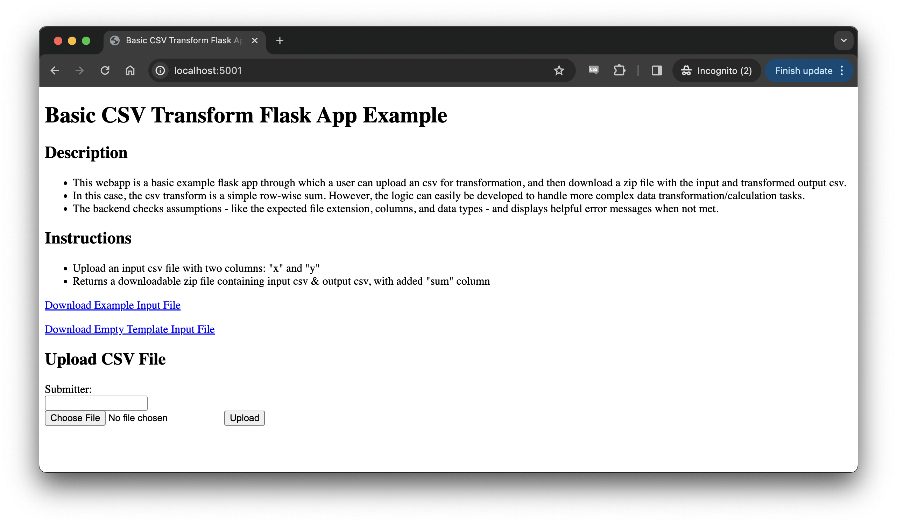
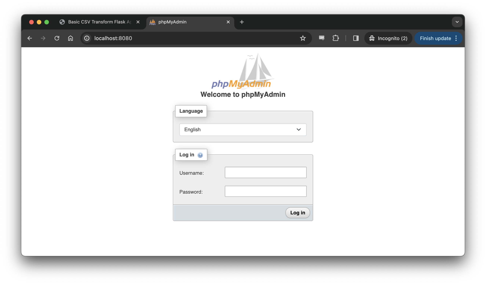
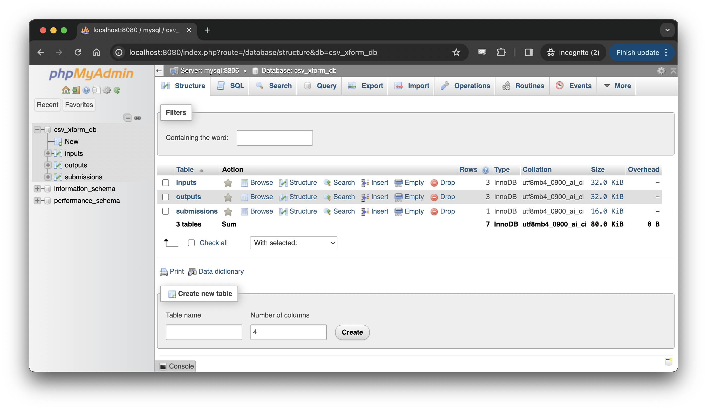
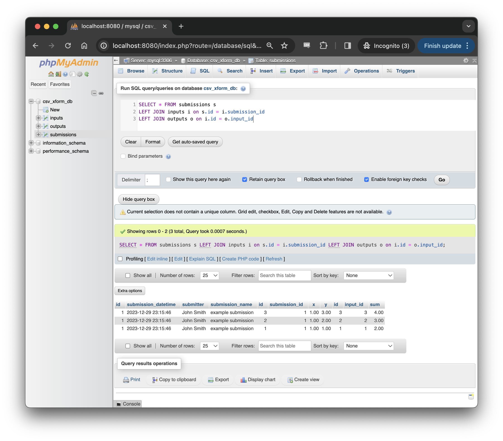
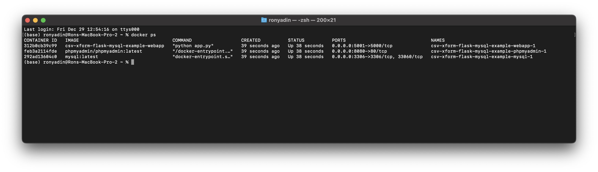

# CSV Transform Flask App with MySQL Database
## Overview
- A project demonstrating an extensible architecture for a containerized, full-stack webapp, capable of applying custom transform logic to a csv file.  

- There is a user interface webpage where a user can upload an input csv file, then view & download the transformed output csv. Additionally, the inputs, outputs, and submission events are tracked in a MySQL relational database. This database can be accessed through a second database admin webpage, where the database can be managed and queried with SQL. 
  
- This example simply calculates & adds a "sum" column to a two-column csv (with header columns "x" and "y").

- However, by following the steps below in the section <i>**How To Modify**</i> , this example can serve as boilerplate code for more complex calculation logic, and be used to host a wide variety of data transformation solutions.

### Skills Highlighted
- Tech stack: docker-compose, Flask (python, HTML), MySQL (database development, loading, and querying)
- Best practices: secrets management, input validation, error handling, comments & documentation
___
## Project File Structure
```
/csv-xform-flask-mysql-app
|-- data (for example files & output zip files)
|   |-- empty_template_input_file.csv
|   |-- example_input_file.csv
|-- readme_resources
|   |-- csv-xform-flask-webapp-example.png
|   |-- csv-xform-nominal-docker-ps-example.png
|   |-- csv-xform-phpmyadmin-home-example.png
|   |-- csv-xform-phpmyadmin-login-example.png
|   |-- csv-xform-phpmyadmin-query-example.png
|-- webapp
|   |-- templates
|       |-- error.html
|       |-- index.html
|   |-- app.py
|   |-- csv_transform.py
|   |-- Dockerfile
|   |-- requirements.txt
|-- .gitignore
|-- docker-compose.yml
|-- env.txt (MUST BE CHANGED TO .ENV LOCALLY, REPLACE DEFAULT VALUES)
|-- init.sql
|-- LICENSE
|-- README.md
```
___
## Requirements
1. Supported architectures: ```amd64```,  ```arm64v8```
1. Ensure Docker is installed - follow [the install instructions found here](https://docs.docker.com/desktop/) to install it
    - Docker Desktop recommended for MacOS & Windows. Docker Enginge and Docker Compose installed on 64-bit linux should also work (but as of yet, not tested). 
1. Clone or download this repo to copy the required files & file structure locally
    - Open a terminal window and run: ```git clone --depth 1 https://github.com/ron-yadin/csv-xform-flask-mysql-app.git```
    - Alternatively, click green ```Code``` button >  ```Download ZIP```, then unzip the file locally
1. Convert the ```env.txt``` file into a configured ```.env``` file locally
    - rename the ```env.txt``` template file as  ```.env```, and replace the default user name, passwords, database name with custom secret values
    - this is a security best practice to avoid publication of sensitive login information - the ```.env``` is in the ```.gitignore``` file, and will not be included in version control
## To Run Locally
1. Ensure Docker daemon is running locally (by starting Docker Desktop, for example)
1. Open a terminal window
1. Navigate to the project folder ```cd local/path/to/csv-xform-flask-mysql-app```    
    - update the path to match project folder location in local file system 
1. Run the command: ```docker-compose up --build```
    - optionally, add the ```-d``` flag to run in "detached mode" (in the background)
1. Open a web browser and visit ```localhost:5001``` for the webapp user interface
    - There will be a description, instructions, links to download an example input file & empty input file template, and a form to submit an input csv and submitter name. 

1. Open a web browser and visit ```localhost:8080``` for the MySQL database administration interface
    - use the user name (```MYSQL_USER```) & password (```MYSQL_PASSWORD```) configured in the ```.env``` file to sign into the MySQL admin dashboard

    - To inspect & query tables, click the database name (```MYSQL_DATABASE```) in the left panel. Tables will be shown and "SQL" option in the top navigation bar will open a box to enter queries
        - example SQL query to run: 
        ```
        SELECT * FROM submissions s 
        LEFT JOIN inputs i on s.id = i.submission_id 
        LEFT JOIN outputs o on i.id = o.input_id
        ```


1. To stop the app - if the ```-d``` flag was omitted, then press ```Ctrl+C```. If running in "detached mode", run ```docker-compose down```. 
    - Note: the data in the MySQL database persists between container restarts in a local docker volume
    - Running ```docker-compose down -v``` will remove the volume causing the data to be lost - avoid this or utilize it depending on the desire to either persist or delete the MySQL db data between container restarts
## Notes
1. the ```init.sql``` file includes the insertion of a few rows of example data upon initialization, to ensure the tables get created even in the absence of any user action. These lines can be removed if no example data is desired.
1. Upon submitting an input file in the user interface webpage, a link appears to download the transformed results. This results file is a zip file, with the filename YYYY-MM-DD_HH:MM:SS_\<input_filename\>.zip, which contains 2 similarly named csvs - one representing the input file & the other representing the output file. This zip file should also be saved to the data directory. 
## Troubleshooting
1. If deployment attempted on non-supported system architecture, might see an error like: ```no matching manifest for <non-supported/system/architecture> in the manifest list entries```
1. If issues arise in connecting to or executing actions with either user webapp or MySQL admin webapp, examine the container status & docker logs
    - In a terminal window, run ```docker ps```. There should be 3 containers running

    - If running in detached mode, run ```docker logs <container id>``` for each container - examine if any ```exited with error code #```. This would indicate an issue, and provide information for further troubleshooting.
    - If running in streaming mode (not detached), simply examine the logs in the terminal window 
___
## How To Modify
1. Edit the ```init.sql``` file to create the tables to match the new desired data model for tracking of inputs, outputs, and submission events
1. Change ```csv_transform.py``` file
    - If necessary, update how the file object content is parsed into a pandas dataframe
        - ex: if new csv has a header rows that must be skipped
    - Change assumption check sections in ```try/except``` blocks to match assumptions for new input csv
        - Update any ```error_message_str``` objects to match new assumption checks
    - Change transformation/calculation logic as required to get from new input dataframe to output dataframe
    - Update the database loading section to match the update tables in the new data model
1. Update the ```requirements.txt``` file
    - If new logic uses any additional packages/libraries, add them to the ```requirements.txt``` file to ensure availability in the container environment
1. Add appropriate example files to the ```/data``` folder
    - Replace the ```example_input_file.csv``` and ```empty_template_input_file.csv``` with relevant example and template files
    - The ```index.html``` references those file names exactly for the example and template download links. If those file names change, update the download links in the ```index.html``` file 